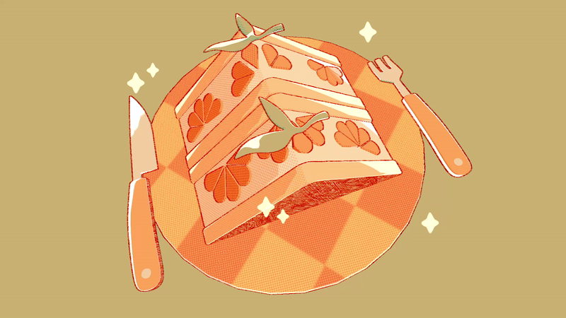

# Orange Cake

## Demo:

Click [here](https://www.youtube.com/watch?v=tel-0QbYZ38) for a demo video, and [here](https://www.rfeng.dev/projects/1-stylized-cake) for a full breakdown on my website.

|  Anime sparkles |  Pixel filter |
|:--:|:--:|
|  Color mapping |  Old photograph |

## Project Overview:
Taking a piece of concept art, I recreated it in Unity using Shadergraph and HLSL in order to explore stylized graphics techniques and real-time rendering workflows.

### Concept Art
Original work by [@fresh_bobatae](https://freshbobatae.carrd.co/) / Emily Kim

## Features
- [x] Toon shading
- [x] Multiple light support
- [x] Halftone shadow texture
- [x] Rim highlight
- [x] Vertex Animation
- [x] Depth buffer sobel filter outlines
- [x] Outline animation
- [x] Color mapping post-process
- [x] Vignette post-process
- [x] Animted texture overlay post-process
- [x] Pixel filter post-process
- [x] Animated post-process sparkles & polygons
